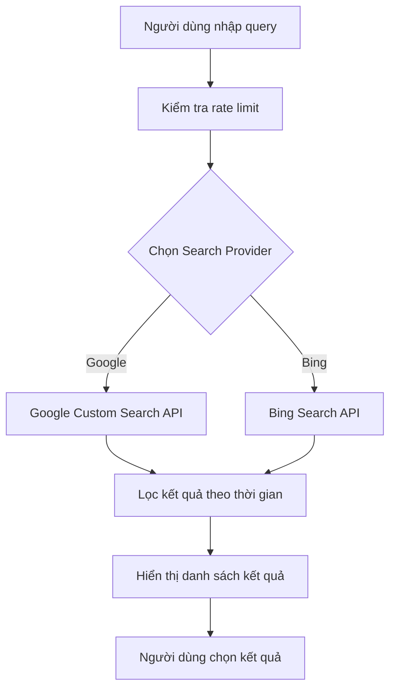
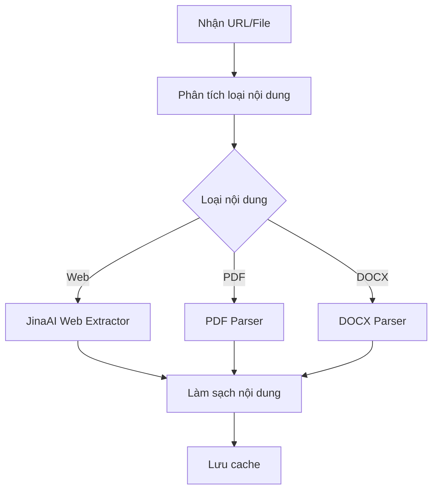
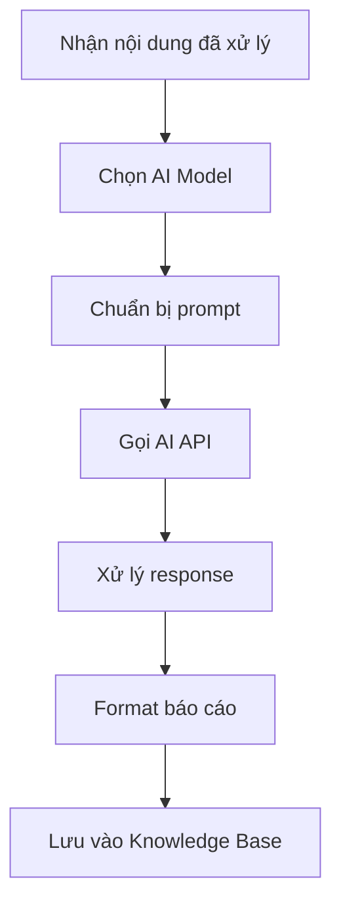
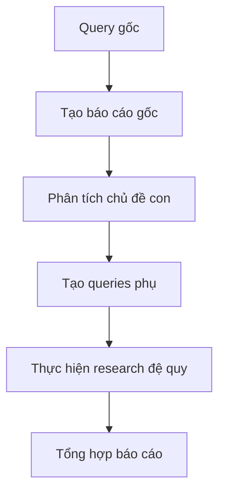
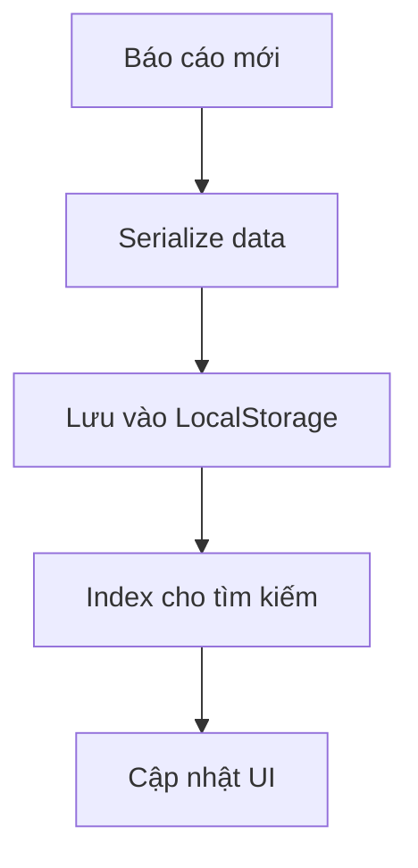
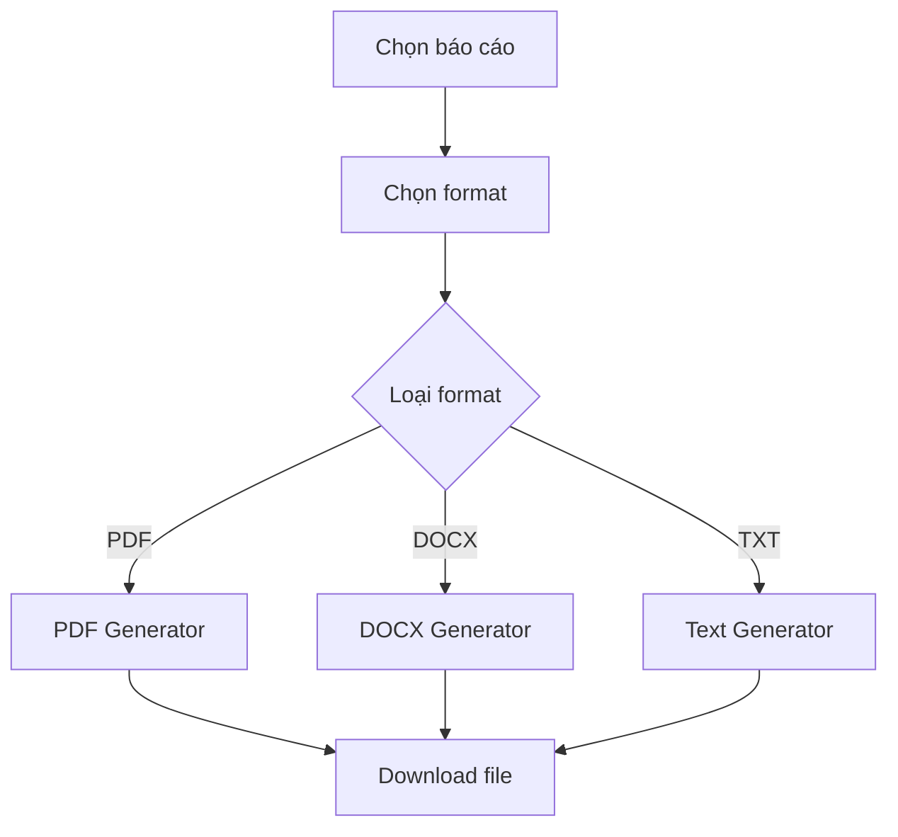

# Flow Hoạt Động Chi Tiết Các Chức Năng

## 1. Chức năng Tìm kiếm Web

### Luồng xử lý:

### Chi tiết các bước:

1. **Nhập Query**

    - Validate input
    - Kiểm tra độ dài query
    - Làm sạch query

2. **Rate Limiting**

    - Kiểm tra quota
    - Đếm số request/phút
    - Xử lý hàng đợi nếu cần

3. **Tìm kiếm**
    - Gọi API tương ứng
    - Xử lý lỗi và retry
    - Cache kết quả

## 2. Chức năng Trích xuất Nội dung

### Luồng xử lý:

### Chi tiết các bước:

1. **Phân tích nội dung**

    - Kiểm tra định dạng
    - Validate URL/file
    - Chuẩn bị parser

2. **Xử lý nội dung**
    - Extract text
    - Xử lý metadata
    - Loại bỏ noise

## 3. Chức năng Tạo Báo cáo

### Luồng xử lý:

### Chi tiết các bước:

1. **Chọn Model**

    - Kiểm tra availability
    - Validate API key
    - Chọn prompt template

2. **Xử lý AI**
    - Gửi request
    - Xử lý streaming
    - Handle errors

## 4. Chức năng Flow Research

### Luồng xử lý:

### Chi tiết các bước:

1. **Research Tree**

    - Xây dựng cấu trúc cây
    - Tracking dependencies
    - Quản lý depth

2. **Consolidation**
    - Merge reports
    - Remove duplicates
    - Create summary

## 5. Chức năng Knowledge Base

### Luồng xử lý:

### Chi tiết các bước:

1. **Lưu trữ**

    - Format data
    - Compress nếu cần
    - Manage storage limit

2. **Truy xuất**
    - Search functionality
    - Filter options
    - Sort results

## 6. Chức năng Export

### Luồng xử lý:

### Chi tiết các bước:

1. **Format Selection**

    - Validate format
    - Prepare templates
    - Configure options

2. **Generation**
    - Apply styling
    - Add metadata
    - Create download link
